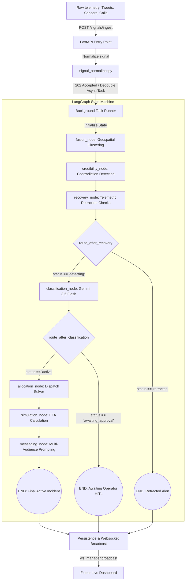

# 📘 CIRO: System Documentation & Integration Guide

Welcome to the technical architecture guide for **CIRO (Crisis Intelligence & Response Orchestrator)**. This document outlines the overall system design, non-linear state graph, database layers, mock/production APIs, specialized AI agents, and real-time frontend integration.

---

## Unique Value Proposition (UVP)

CIRO's Unique Value Proposition is its **non-linear, agentic workflow (powered by LangGraph)** combined with a highly responsive, real-time **Flutter UI**. By shifting away from rigid sequential AI chains, CIRO operates as an autonomous, self-healing orchestration engine that adapts to dynamic crisis situations. It automatically filters out conflicting signals, scales infinitely via **Google Cloud Run**, and empowers human dispatchers with fully transparent AI reasoning trails—accelerating emergency response without sacrificing human oversight.

---

## Directory Structure

```text
ciro/
├── backend/                  # Python backend (FastAPI, LangGraph agents, Firebase services)
│   ├── agents/               # Individual LangGraph node functions and logic
│   ├── api/                  # FastAPI routers and HTTP endpoints
│   ├── graph/                # LangGraph state definitions, nodes, and conditional edges
│   ├── models/               # Pydantic schemas (Agent IO, incidents, signals)
│   └── services/             # External service wrappers (Firestore, WebSocket manager)
├── ciro-mobile/              # Flutter mobile application
│   ├── lib/core/             # Theming, routing, and shared utilities
│   ├── lib/data/             # Data models and API repositories
│   └── lib/features/         # UI Screens (Traces, Map, Crisis Feed, Alerts)
├── docs/                     # Additional project documentation
└── deploy_to_gcp.sh          # Shell script for deploying the backend to Google Cloud Run
```

---

## 1. Overall Design & Architectural Philosophy

Traditional AI pipelines often rely on **rigid linear chains** (e.g. LangChain SequentialChains) that call LLMs in a fixed order. In crisis response, linear chains are fragile: if a sensor throws an error or an LLM times out, the entire dispatch system crashes.

CIRO is built on a **cyclic, event-driven state machine pattern using LangGraph**. 

1.  **State-Centric Architecture**: The orchestrator does not pass variables from function to function. Instead, it mutates a centralized, typed state (`IncidentState`). This guarantees single-source-of-truth consistency.
2.  **State Reducers for distributed tracing**: By declaring `errors: Annotated[List[str], operator.add]` and `agent_traces: Annotated[List[dict], operator.add]`, CIRO uses LangGraph's compiler to append traces chronologically. This prevents subsequent nodes from overwriting previous agent audit trails.
3.  **Strict Asynchronous Decoupling**: FastAPI ingests alerts instantly, normalizes them, triggers the orchestrator asynchronously, and returns a `202 Accepted` status to the sender. This decoupling shields the frontend client from the LLM execution delay, letting the system ingest a flood of concurrent alerts without choking the request thread.

---

## 2. Detailed System Architecture & Data Flow

Below is the complete path of an alert, from raw sensor breach or social tweet to dispatcher map visualization:



### The Step-by-Step Lifecycle:
1.  **Ingestion**: FastAPI receives a raw payload (Pydantic `RawSignal`). The signal normalizer extracts keywords, parses coordinates, and assigns a baseline urgency score.
2.  **Geospatial Clustering**: The **Fusion Node** calculates Haversine distances. If the new signal falls within **1.5km** of an active incident, it appends it to that incident's signal list. Otherwise, it instantiates a new incident context.
3.  **Contradiction & Validation Checking**: The **Credibility Node** analyses keyword combinations across the clustered signals to check for physical contradictions (e.g. one report claiming "torrential rain" and another claiming "sunny day").
4.  **Autonomous Recovery**: The **Recovery Node** monitors field reports. If a highly credible service member reports a "false alarm," the state status updates to `retracted`. The conditional edge `route_after_recovery` routes directly to `END`, immediately cancelling downstream allocation and alerting stakeholders via WebSockets.
5.  **LLM Classification & Graceful Fallback**: The **Classification Node** configurations call `gemini-3.5-flash` with strict JSON schemas. If the Gemini API key is missing, rate-limited, or throws an error, the node catches the exception, logs it in the state's `errors` list, and executes a **Rule-Based Fallback** to keep the pipeline moving.
6.  **Human-In-The-Loop (HITL) Gate**: If the classification confidence falls below **70%**, the state status becomes `awaiting_approval`. The conditional edge `route_after_classification` halts graph execution. The dispatcher reviews the alert on their map and clicks "Approve," which resumes the graph's execution.
7.  **Resource Allocation**: The **Allocation Node** determines which emergency vehicles (ambulances, police units, shelters) are available, resolves resource conflicts, and dispatches units.
8.  **Simulation & Response Mapping**: The **Simulation Node** estimates travel delays and projects when the resource deployment will reduce the crisis severity.
9.  **Alert Dispatch**: The **Messaging Node** asks Gemini to generate three targeted texts: public alerts, media briefs, and hospital trauma ward heads-ups.

---

## 3. GCP Architecture Deployed on Cloud

The CIRO ecosystem is designed for high availability and elastic scalability, deployed natively on Google Cloud Platform (GCP).

- **Frontend Connectivity**: The Flutter mobile app communicates with the backend via REST APIs and WebSockets, secured behind **Cloud Load Balancing**.
- **Serverless Compute**: The FastAPI application and LangGraph orchestrator are containerized and deployed on **Google Cloud Run**. This allows the backend to scale down to zero during quiet periods and scale out instantly during a massive influx of crisis signals.
- **Asynchronous Task Management**: Heavy LangGraph execution cycles and agentic processing are offloaded to **Cloud Tasks / Cloud Pub/Sub** or processed via asyncio background workers to ensure the API never blocks.
- **Real-Time Data Layer**: All incidents, signals, and agent reasoning traces are persisted in **Cloud Firestore**, which seamlessly pushes state updates back to the mobile clients.
- **External AI & APIs**: The backend connects natively to the **Gemini AI API** for intelligent classification and messaging, as well as **OpenWeatherMap** for environmental telemetry.


---
## 4. Mock & Real API Integrations

To ensure high availability in production and friction-free setup for developers, the backend uses a hybrid mock-real service layer:

*   **Google Gemini API (Production)**: Connects to the Generative AI SDK using `gemini-3.5-flash` for rich reasoning and JSON formatting.
*   **Google Cloud Firestore (Production / Dual-mode)**: Serves as the real-time database. 
    *   *Subtle Resilience Feature:* If Firestore project quotas are exceeded (429 ResourceExhausted) or credentials are empty, the `FirestoreService` catches the exception during startup and automatically toggles `self._available = False`. It redirects all queries to an optimized, thread-safe local **In-Memory Store**, allowing the server to function without crashing.
    *   *MOCK_FIRESTORE Toggle:* Setting `MOCK_FIRESTORE=true` in `.env` immediately forces mock mode to preserve network resources.
*   **OpenWeatherMap API (Production)**: Gathers live local weather metrics (rain levels, temperatures) to validate incoming signals.
*   **Mock Social/Sensor Streams**: Generates streams of citizen tweets and IoT water levels/heat metrics for hackathon demonstrations.

---

## 5. Detailed Agent Specifications

CIRO's agents are stateless, isolated workers designed for deterministic state transitions:

| Node Name | Class/Function | Core Tech | Subtle Unique Advantage |
| :--- | :--- | :--- | :--- |
| **Fusion** | `fusion_node` | Haversine Formula | Replaces database query loops with localized geographical clustering. |
| **Credibility** | `credibility_node` | Coherence Scoring | Computes source credibility and cross-checks telemetry contradictions. |
| **Recovery** | `recovery_node` | Regex & Metadata Parsing | Automatically retracts alerts based on high-authority field commands. |
| **Classification**| `classification_node`| Gemini 3.5 Flash | Self-contained try-catch block with automated rule-based regex fallback. |
| **Resource Allocation**| `allocation_node` | Priority Dispatch Solver | Assigns assets based on severity and resolves resource lock-ups. |
| **Simulation** | `simulation_node` | Projection Formulas | Calculates crisis decay rate and projects response ETAs. |
| **Messaging** | `messaging_node` | Gemini 3.5 Flash | Generates tailored copy for public warnings, medical briefs, and media statements. |

---

## 6. Frontend-Backend Integration & Real-Time Sync

The Flutter mobile dashboard communicates with the backend using three primary layers:

1.  **Low-Latency WebSockets**: The Flutter client connects to the FastAPI WebSocket server (`/ws`). The instant a LangGraph execution cycle updates an incident state, the server broadcasts the Pydantic dictionary to the socket. This ensures map icons update in real-time.
2.  **Live Trace Feed**: The WebSocket room maps logs from the state's `agent_traces` list directly to the mobile UI timeline. Operators see which AI node is executing in real-time.
3.  **Human Verification Endpoints**: When an operator verifies a pending low-confidence crisis, calling `POST /incidents/{incident_id}/approve` triggers the backend to run the remaining LangGraph allocation and notification nodes.

---

## 7. The Mobile Client: Flutter UX/UI

The frontend is a bespoke **Flutter Mobile Application** designed for rapid cognitive processing under the stress of emergency operations.

### Visual Language & Design Tokens
*   **Curated Dark Theme**: Employs a low-fatigue charcoal black foundation (`#121212` / `#1E1E1E`) to reduce screen glare for night-shift operators.
*   **Saliency Mapping (Color Theory)**: Color is used purely to communicate urgency. High-severity alerts pulse in crimson red (`#FF4D4D`), pending reviews are flagged in warning amber (`#FF9F0A`), and verified, running assets shine in calming emerald green (`#34C759`).
*   **Fluid Micro-Animations**: Card transitions use physics-based spring curves. Beacons on the map use a continuous radial pulse to represent real-time signal density.

### Key UI/UX Features:
1.  **Interactive Incident Map (`incident_map`)**:
    *   Integrates mapping SDKs to display active incidents, GPS clustering, and resource dispatch routes.
    *   Draws visual transparent circular overlays showing the "Affected Radius" computed by the geospatial fusion node.
2.  **The Live Trace Timeline Widget (`agent_traces_screen.dart`)**:
    *   Directly binds to the WebSocket connection.
    *   Renders a vertical timeline representing the LangGraph. As nodes execute on the backend, the corresponding icon pulses on the timeline:
        *   🟢 *Green Checks:* Nodes executing successfully (e.g. LLM classification).
        *   🟡 *Orange Shields:* Nodes using fallback rule-based execution.
        *   🔵 *Pulsing Beacons:* Active execution focus.
3.  **The Crisis Signal Feed**:
    *   A continuous stream of incoming tweets, sensor breaching values, and citizen alerts.
    *   Uses cards that slide in with micro-animations when a new signal is ingested.
4.  **The Human-in-the-Loop Queue Panel**:
    *   Presents a stack of pending incident cards (confidence < 70%).
    *   Operators are shown the conflicting reports and can tap a single key to approve or discard the alert, resuming backend orchestration instantly.
5.  **State Management Architecture**:
    *   Built using clean architecture principles and managed with a robust state manager (like **Riverpod** or **Provider**). 
    *   Maintains a continuous async stream listener linked to the WebSocket, allowing zero-latency rendering of incoming signals even during the 150-signal concurrency stress tests.

